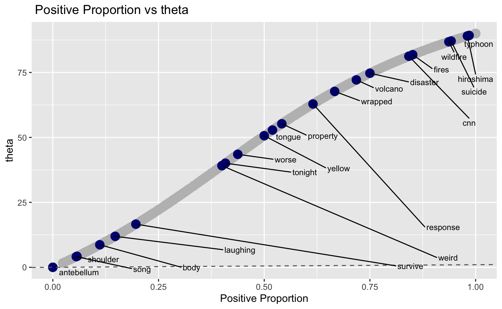

# Tweets_Catastrophe_Classification
A classification of tweets - Catastrophe or not ? A HavardX Capstone Project

These files are part of assignment 2 for the Capstone unit of HarvardX's [Certificate in Data Science](https://www.edx.org/professional-certificate/harvardx-data-science). 

This report attempts to create a machine learning model to identify tweets based on a pre-defined category,in this case if the tweet relates to a disaster/catastrophe event or not.

## Key Files: ##

* [PDF Report](https://github.com/carlosyanez/Tweets_Catastrophe_Classification/raw/master/Twitter_Classifier.pdf)

* [R Code](https://github.com/carlosyanez/Tweets_Catastrophe_Classification/blob/master/twitter_classifier.R)

* [Markdown File](https://github.com/carlosyanez/Tweets_Catastrophe_Classification/blob/master/Twitter_Classifier.Rmd)

